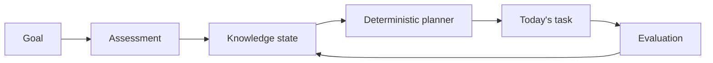

# SkillPath

SkillPath is an adaptive learning planner that answers: **what is the highest-value
thing this learner should do next?**



Phase 1 is executable: a learner can register, sign in, choose the seeded Java
Backend Intern template, create one active goal, reload it, and sign out.

Phase 2 adds the published, versioned Java Backend knowledge graph. Clients can query
goal graphs, nodes, prerequisites, and dependents; curator/admin sessions can validate
and atomically publish successor graph versions. The visual learner roadmap remains a
later phase.

Phase 3 adds an eight-question learner diagnostic with safe resume, objective
deterministic scoring, idempotent attempts, concept-level evidence, and a durable
handoff for the future Knowledge State module. Diagnostic output is observational
evidence, not mastery or a learning recommendation.

Phase 4 consumes that handoff through an idempotent leased outbox, preserves an
append-only evidence ledger, and builds deterministic `knowledge-state-v1` projections
with time-decayed effective mastery and confidence. Learners can inspect the localized
state at `/knowledge`; `review-interval-v1` schedules mastered concepts. A personalized
Today plan is intentionally still a later phase.

The current learner journey is available in Vietnamese and English. New browsers default
to Vietnamese, the header selector persists the browser preference, and localized goal,
knowledge, and diagnostic content keeps the same domain IDs and scoring. New registration
and goal forms default to `Asia/Ho_Chi_Minh`.

## Quick start

Prerequisites: Java 21, Node 24, npm 11, Docker with Compose, and PowerShell for the
convenience scripts. Maven is downloaded by the committed wrapper.

```powershell
Copy-Item .env.example .env
# Set MYSQL_PORT=3307 in .env when local port 3306 is occupied.
docker compose up --detach --wait mysql
powershell -NoProfile -ExecutionPolicy Bypass -File .\scripts\db-migrate.ps1
$env:MYSQL_PORT = '3307' # only when your .env uses the local override
.\backend\mvnw.cmd -f backend\pom.xml spring-boot:run
```

In a second terminal:

```powershell
npm.cmd --prefix frontend ci
npm.cmd --prefix frontend run dev
```

Open `http://localhost:5173`. Vite proxies `/api` to the backend at port 8080.
Alternatively, run the complete containerized stack with
`powershell -NoProfile -ExecutionPolicy Bypass -File .\scripts\dev-start.ps1`; use
the matching `dev-stop.ps1` command to stop it. If local policy already permits
project scripts, the shorter `.\scripts\...` form also works.
The Compose backend restarts after a transient database startup failure. If the
browser reports 502, check `docker compose --profile app ps --all` and
`docker compose logs backend` before retrying the page.

## Validate

```powershell
powershell -NoProfile -ExecutionPolicy Bypass -File .\scripts\verify.ps1
powershell -NoProfile -ExecutionPolicy Bypass -File .\scripts\audit.ps1
```

Portable equivalents are `backend/mvnw -f backend/pom.xml clean verify`, the npm
scripts in `frontend/package.json`, and `docker compose config`. The backend
integration suite uses a real `mysql:8.4` Testcontainer, never H2.

The canonical API contract is `docs/api/openapi-v1.yaml`. Regenerate frontend
types with `npm --prefix frontend run api:generate`; CI rejects contract drift.

## MySQL Workbench

Connect to `127.0.0.1`, schema `skillpath`, user `skillpath_app`, and the port/password
from `.env` (this workstation uses port 3307). Workbench is for inspection and
`EXPLAIN`; every shared schema change is a new forward-only Flyway migration.

## Start here for changes

1. `AGENTS.md`
2. `PROJECT_CONTEXT.md`
3. `DEVELOPMENT_RULES.md`
4. `docs/product/MVP_SCOPE.md`
5. `docs/architecture/SYSTEM_ARCHITECTURE.md`
6. The relevant domain specification under `docs/domain/`

## Technology baseline

- Backend: Java 21, Spring Boot 3.5.16, Maven Wrapper
- Frontend: React 19, TypeScript 5.9, Vite 8
- Database: MySQL 8.4 LTS, Flyway schema ownership
- Testing: JUnit 5, Testcontainers MySQL, ArchUnit, Vitest, Testing Library
- Packaging: MySQL-only host development or complete app Compose profile

## Documentation map

| Area | Location |
|---|---|
| Product definition | `docs/product/` |
| Architecture and data | `docs/architecture/` |
| Core domain rules | `docs/domain/` |
| API contract and OpenAPI | `docs/api/` |
| AI boundaries | `docs/ai/` |
| Development and testing | `docs/development/` |
| Architecture decisions | `docs/adr/` |
| Phase plans | `docs/plans/` |
| Open-source/research register | `docs/research/` |

Do not start feature implementation from this README alone. Follow `AGENTS.md`.
