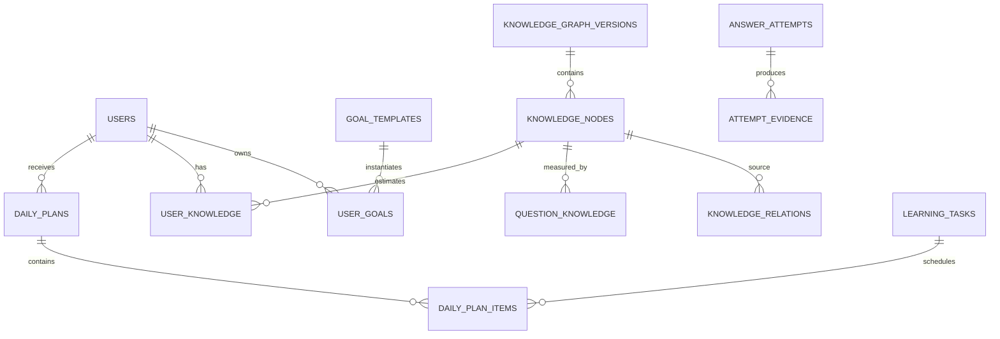

# Database Design — MySQL

## Baseline

- MySQL 8.4 LTS, InnoDB, `utf8mb4`.
- Flyway is the schema source of truth.
- MySQL Workbench is used for local connection, inspection, `EXPLAIN`, and optional diagrams.
- Hibernate schema mode: validate; never update/create in shared environments.
- Store timestamps as UTC (`TIMESTAMP(6)` where range is sufficient; otherwise consistently use `DATETIME(6)` with UTC convention).
- IDs use `BIGINT` generated by the application/database for MVP; public APIs may expose opaque IDs. Do not mix strategies without ADR.
- Scores use `DECIMAL(5,4)` constrained to `[0,1]` where applicable.

## Core table groups

| Group | Tables |
|---|---|
| Identity | `users`, `user_credentials`, `user_roles` |
| Goals | `goal_templates`, `user_goals` |
| Knowledge | `knowledge_graph_versions`, `knowledge_nodes`, `knowledge_relations`, `goal_knowledge` |
| Assessment | `questions`, `question_versions`, `question_knowledge`, `assessment_sessions`, `answer_attempts`, `attempt_evidence` |
| Localization overlays | `goal_template_translations`, `knowledge_node_translations`, `question_version_translations` |
| Progress | `knowledge_evidence`, `user_knowledge`, `user_misconceptions` |
| Learning | `resources`, `knowledge_resources`, `task_templates`, `task_template_knowledge`, `learning_tasks`, `learning_sessions` |
| Planner | `planner_policies`, `planning_snapshots`, `planner_decisions`, `planner_decision_candidates`, `daily_plans`, `daily_plan_items` |
| Review | `review_schedules`, `review_attempts` |
| Reliability | `outbox_events`, `idempotency_records` |

Phase 1 physically implements `users`, `user_credentials`, `user_roles`,
`SPRING_SESSION`, `SPRING_SESSION_ATTRIBUTES`, `goal_templates`, `user_goals`, and
`idempotency_records`. Phase 2 physically implements `knowledge_graph_versions`,
`knowledge_nodes`, `knowledge_relations`, `goal_knowledge`, and the append-only
`knowledge_version_events` lifecycle audit. Phase 3 physically implements `questions`,
`question_versions`, `question_knowledge`, `assessment_sessions`,
`assessment_session_questions`, `answer_attempts`, `attempt_evidence`, and the generic
`outbox_events` reliability envelope. V10/V11 add Vietnamese presentation overlays for
the canonical goal template, 17 knowledge nodes, and eight question versions. Later
table groups remain logical design only.

Flyway history at the Phase 1 boundary:

| Migration | Purpose |
|---|---|
| V1 | Identity plus official Spring Session JDBC schema |
| V2 | Goal and idempotency tables, including one-active-goal generated-column uniqueness |
| V3 | Seed `JAVA_BACKEND_INTERN` as data |
| V4 | Forward correction aligning `default_daily_minutes` with the Java integer mapping |
| V5 | Rename draft `auth_*` tables to authoritative `user_credentials`/`user_roles` names |
| V6 | Versioned knowledge graph, goal mapping, publication uniqueness, and lifecycle audit |
| V7 | Canonical project-authored Java Backend v1 graph and goal mapping |
| V8 | Versioned assessment questions, pinned sessions, attempts, evidence, and outbox |
| V9 | Canonical project-authored Java Backend objective diagnostic |
| V10 | Version-owned goal, knowledge-node, and question presentation translations |
| V11 | Project-authored Vietnamese goal, graph, and diagnostic content |
| V12 | Outbox leases/retries plus append-only progress evidence and deterministic projection |
| V13 | Review schedule/attempt schema and allowlisted misconception definitions |

V4 and V5 intentionally demonstrate the forward-fix rule: an applied migration was
not rewritten after integration validation exposed a mismatch/context conflict.

Table ownership follows module boundaries: `goal_templates`/`user_goals` belong to
`goal`; graph tables and `goal_knowledge` belong to `knowledge`; evidence and
`user_knowledge` belong to `progress`; `review_schedules`/`review_attempts` belong to
`review`. A denormalized `next_review_at` in a progress/read projection is not an
authority for advancing the schedule.

Every graph version has a stable `curriculum_key`. Future IT specializations create
new curriculum/version data; they do not require parallel schema families.

## Key relationships



## Mandatory constraints

- Unique user email after normalized form.
- Unique active relation `(version_id, source_node_id, target_node_id, relation_type)`.
- No relation self-loop.
- Unique `(user_id, knowledge_node_id)` for `user_knowledge`.
- Unique evidence source key to prevent replay duplicates.
- Unique idempotency key scoped to user + operation.
- Foreign keys for ownership and graph/version integrity where feasible.
- `version` column for optimistic locking on mutable aggregates/projections.
- Internal MVP IDs are `BIGINT`; API contracts treat them as opaque and clients must not infer ordering or numeric semantics.

Cycle validation for prerequisite graph belongs in the domain publish transaction; SQL constraints alone are insufficient.

Phase 2 uses a generated nullable `published_curriculum_key` unique constraint to
enforce one published version per curriculum. Relation endpoint composite foreign keys
enforce same-version edges. Runtime publication locks all versions of the curriculum,
flushes retirement before publication to satisfy the generated unique key, and keeps
retirement, publication, and audit in one transaction.

Phase 3 uses generated nullable goal IDs to enforce at most one active diagnostic and
one completed diagnostic baseline per goal. Session questions snapshot immutable
question versions. Unique attempt idempotency and session-question keys, unique
attempt-evidence source keys, and unique outbox event keys form layered duplicate
protection. Attempt, evidence, final session completion, and pending outbox records are
written atomically.

Localization tables are owned beside their canonical sources. Their composite keys bind
one allowlisted locale to one immutable source version. English remains in the source
columns; Vietnamese rows contain presentation text only. Localized question options must
retain the canonical opaque option-ID set, which is checked again by the assessment
application before delivery. Answer keys are never copied into translation tables.

## Index principles

Create indexes from actual query paths. Initial expected indexes include:

- active goal by user/status;
- relations by source/type/version and target/type/version;
- questions by status/purpose/difficulty;
- attempts by user/session/submitted time;
- evidence by user/node/observed time;
- review schedule by status/next review;
- plan by user/date/status;
- outbox by publish status/created time.

Verify nontrivial queries using MySQL Workbench `EXPLAIN ANALYZE` against representative data before adding speculative indexes.

## Migration policy

1. Every schema/reference change is a new Flyway migration.
2. Prefer expand → backfill → switch → contract for breaking changes.
3. Migrations must work on a clean database and an upgrade copy.
4. Large backfills use application jobs or chunked SQL with restart strategy.
5. Seed only canonical reference/curriculum data; never seed personal production data.
6. Workbench manual edits may be used only in disposable local schemas and must be converted to Flyway before sharing.

## Local Workbench connection

Default development convention (override via `.env`, never commit secrets):

```text
Host: 127.0.0.1
Port: 3306 (use the `.env` override `3307` when 3306 is already occupied)
Schema: skillpath
User: skillpath_app
```

Use a separate migration/admin user if production privileges require it. Application credentials should not have global or user-management privileges.
