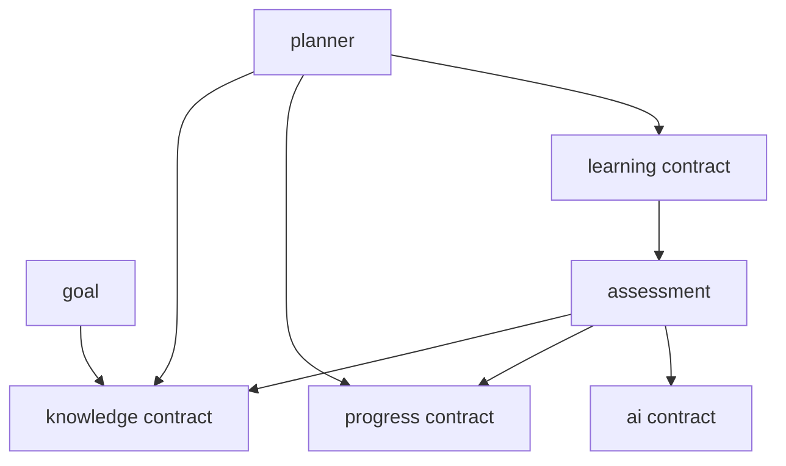

# Module Boundaries

## Modules

| Module | Owns | Public capabilities |
|---|---|---|
| `auth` | credentials/session/roles | authenticate, authorize, current principal |
| `user` | profile, timezone, preferences | retrieve/update own profile |
| `goal` | goal templates, user goal lifecycle | create/activate/complete goal, expose goal-template identity |
| `knowledge` | curriculum/graph versions, nodes, relations, versioned goal-template knowledge mapping | traversal, validation, prerequisites, goal subgraph |
| `assessment` | questions, sessions, attempts, evaluation | start, submit, produce evidence |
| `progress` | evidence ledger, knowledge projection, misconception | append evidence, snapshot, rebuild |
| `learning` | resources, task templates/instances, sessions | assign/start/complete/skip task |
| `planner` | policy, candidates, decisions, plan revisions | recommend/replan/explain |
| `review` | review interval, schedule, attempts, and due state | schedule/complete review, expose review snapshot |
| `ai` | provider clients and structured AI operations | evaluate/generate/explain |

`roadmap` is a learner-facing read model derived from goal + graph + progress + review
+ planner state for MVP, not a separate module owner of prerequisite, mastery, or goal
completion truth. It includes version identifiers and supports bounded graph
neighborhoods for visual progressive disclosure.

Java Backend is the first curriculum, not a module boundary. Additional IT tracks use
new curriculum keys, graph versions, mappings, resources, and task templates through
the same public contracts.

## Dependency direction

Cycles in code dependencies are forbidden. A workflow spanning modules belongs in an application orchestration use case and communicates through contracts/events.

## Contract rules

- Contracts use module-neutral IDs and immutable DTOs, not JPA entities.
- A module may query another only through its published interface.
- A module owns validation of its invariants and tables.
- Goal-template mappings in `knowledge` reference module-neutral goal-template IDs; `knowledge` does not import goal persistence entities.
- The goal-owned HTTP adapter for `/goal-templates/{id}/graph` delegates to the public
  `knowledge.application.KnowledgeGraphQueries` contract. This realizes `goal ->
  knowledge` without a reverse runtime dependency; the knowledge-owned mapping uses a
  database FK only for goal-template existence.
- `review` alone advances review intervals. `progress` may expose `nextReviewAt` only as a derived snapshot received through the review contract.
- Cross-module database joins are avoided in domain writes; dedicated read models may join through controlled query adapters.
- Events are past tense facts, versioned, and idempotently consumed.

## Example

Planner may request `KnowledgeSnapshot` and `UserKnowledgeSnapshot`; it may not import `KnowledgeNodeEntity`, `UserKnowledgeEntity`, or repositories. Assessment may append `EvidenceCommand`; it may not calculate/persist mastery itself.

## Boundary tests

Use ArchUnit to enforce module/layer imports. At minimum test:

- no controller-to-repository direct dependency;
- no external module importing `.infrastructure.persistence`;
- domain packages depend only on allowed JDK/domain types;
- AI adapter cannot import progress repositories.
