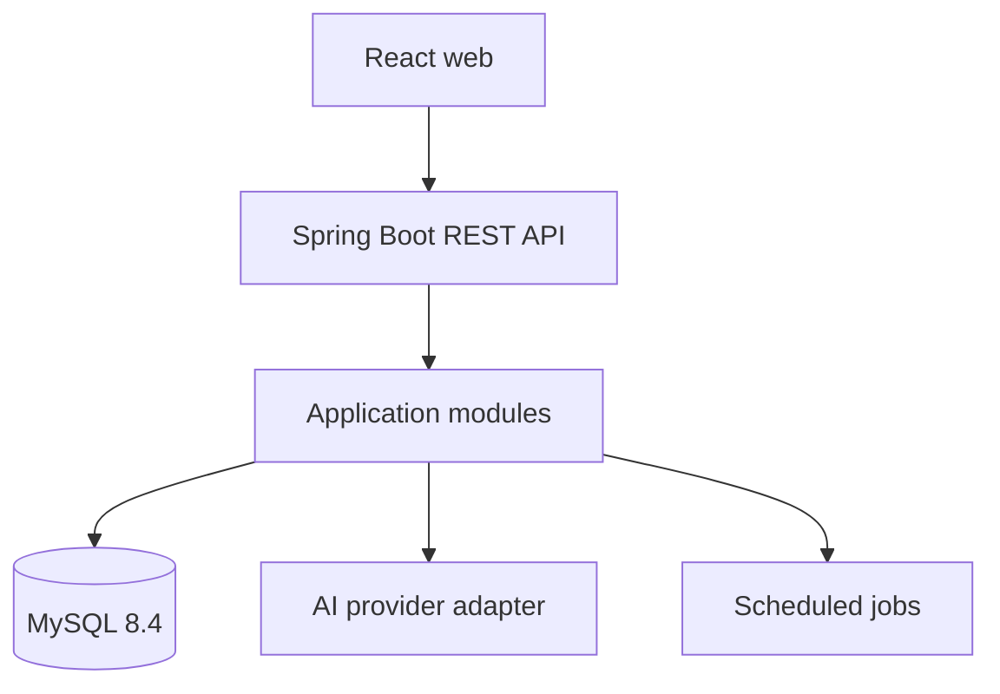

# System Architecture

## Style

SkillPath uses a **modular monolith** with one Spring Boot deployment, one React web client, and one MySQL database for MVP.



## Backend layers

Within each module:

```text
api/             controllers, transport DTOs, exception mapping
application/     use cases, transactions, public module contracts
domain/          aggregates, policies, value objects, domain events
infrastructure/  JPA, external adapters, configuration
```

Dependencies point inward. Domain code does not depend on controllers, JPA repositories, HTTP clients, or AI SDKs.

## Runtime components

| Component | Responsibility |
|---|---|
| Web | Authenticated user experience and admin/curator utilities |
| API | Use cases, authorization, domain orchestration |
| MySQL | System of record, evidence ledger, projections, plans |
| Scheduler | Review due transitions, retryable evaluation/rebuild jobs |
| AI adapter | Structured generation/evaluation behind domain validation |
| Flyway | Schema and reference-data migration |

The domain engine is curriculum-neutral. Java Backend is the first published
curriculum; future IT specializations are introduced as separately versioned
curriculum/goal graphs and curated content, not as planner code branches.

Phase 5 adds a `learning` module with a Flyway-owned resource/task/sequence catalog,
learner-owned execution sessions, pinned bilingual task content, and idempotent audit
transitions. The React UI exposes an explicitly learner-selected study sequence from
the command center. Phase 6 adds explicit deterministic Today generation and a
read-only visual roadmap from one pinned planning snapshot. Marking a task complete
still cannot mutate evidence or mastery; automatic replanning remains Phase 7.

## Learner roadmap projection

The visual goal map is a read model composed from the published goal subgraph, the
user's knowledge-state snapshot, review state, and the active planner decision. It
exposes the mutually exclusive `knowledgeStatus` (`UNKNOWN`, `LEARNING`,
`PROVISIONAL`, `MASTERED`, `REVIEW_DUE`) separately from planner overlays such as
`current`, `ready`, and `blocked`, and exposes prerequisite explanations.

The projection is read-only and version-stamped. It cannot mutate mastery, waive a
prerequisite, or complete a goal. Phase 6 bounds the whole published graph to 200
nodes and renders the initial 17-node curriculum with dependency-free SVG and a
semantic list. Cursored neighborhoods/progressive disclosure for larger graphs are
still open work; the server rejects oversized graphs rather than silently truncating.

## Communication

- Public REST for web-to-backend.
- A roadmap query adapter may compose module contracts into a learner-facing read model; it does not own prerequisite or mastery truth.
- Direct application contracts between modules for synchronous MVP paths.
- Transactional outbox for important asynchronous domain events when introduced.
- No distributed broker in MVP.
- Scheduled jobs use database-backed locks/leases if multiple instances are deployed.

## Deployment evolution

1. Local: frontend/backend on host; MySQL in Docker.
2. First vertical slice: add development Dockerfiles and full Compose profile.
3. Production: multi-stage immutable images, managed/persistent MySQL, migrations as a controlled release step.

Docker is packaging, not architecture. The system must remain testable without hiding lifecycle or migration errors inside containers.

## Cross-cutting concerns

- Authentication and ownership enforcement at API/use-case boundaries.
- Correlation ID, structured logs, metrics, and health probes.
- UTC storage and explicit user timezone.
- Idempotency keys for submission/completion/replan commands.
- Optimistic locking for concurrently updated state.
- Timeouts and circuit/failure handling for AI calls.

## Forbidden shortcuts

- Frontend talking directly to MySQL.
- AI writing database state.
- Controllers querying another module's repository.
- Shared “common” module containing arbitrary domain logic.
- Workbench-managed schema drift.
- Runtime `ddl-auto=update`; production must use validation with Flyway.
