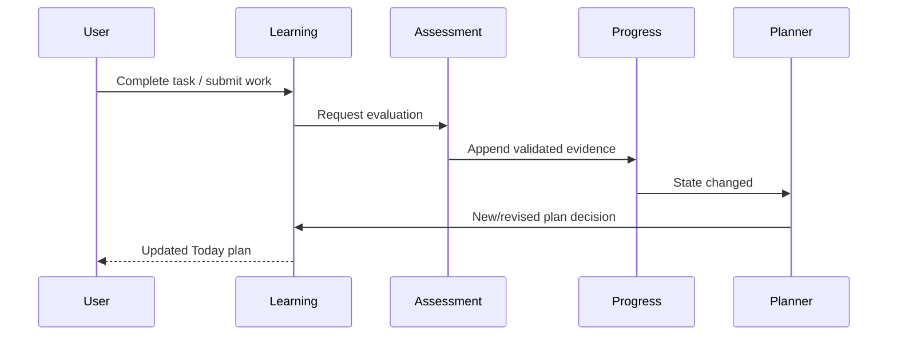

# Adaptive Loop Specification v1

## 1. Purpose

The adaptive loop coordinates modules without transferring ownership of their rules.

## 2. Triggers for replanning

- Diagnostic completed.
- Validated evidence changes knowledge state.
- Task completed, skipped, blocked, or expired.
- User changes today's available minutes.
- Review becomes due.
- Goal or target date changes.
- Curriculum/policy migration explicitly requests replan.

Cosmetic profile changes do not trigger replan.

## 3. Orchestration

1. Command is authorized and validated.
2. Owning module commits state and an outbox event atomically.
3. Consumer processes event idempotently.
4. Progress updates/rebuilds projection if evidence exists.
5. Planner captures `projectionAsOf`, reads a consistent graph/progress/review snapshot, and writes a versioned daily-plan decision.
6. Learning creates/revises unstarted plan items.
7. Roadmap read model exposes the same versions, state labels, blocked paths, current task, and reasons.
8. User sees the new plan and consistent visual route.

For an initial single-process implementation, steps may run synchronously after commit, but contracts and idempotency remain mandatory.

## 4. Plan revision rules

- Preserve completed tasks.
- Do not silently delete in-progress tasks.
- Replace only unstarted items unless user explicitly abandons/replans them.
- Maintain `daily_plan.revision` and supersession link.
- Same trigger/event cannot produce duplicate active revision.
- Replan uses server time plus user's stored timezone for learning-day boundaries.
- Every revision's 1–3 items share one input snapshot and `projectionAsOf`; total estimated minutes obey the planner policy budget/tolerance.

## 5. Failure handling

| Failure | Required behavior |
|---|---|
| AI evaluation timeout | Keep attempt; mark pending/retry or needs review |
| Invalid AI output | Reject evidence; audit; never update state |
| State optimistic-lock conflict | Retry bounded times, then queue/rebuild |
| No eligible task | Run documented fallback; never let AI bypass prerequisite |
| No time-fit task | Offer micro-assessment or ask for more time |
| Replan fails after completion | Completion remains committed; retry replan idempotently |
| Curriculum version retired | Existing history remains; controlled migration required |

## 6. Missed days

Missed tasks do not reduce mastery automatically and are not copied mechanically. At next visit, mark eligible old assignments expired/superseded according to policy, recalculate review urgency, and produce a fresh achievable plan.

## 7. Goal completion

A goal is completion-eligible when all required terminal nodes reach their configured effective mastery and confidence, no critical misconception remains active, and required application/mastery checks pass. The goal module makes the final deterministic transition using a versioned policy.

## 8. Observability

Record correlation ID, trigger, state snapshot/version, graph/policy versions, decision ID, latency, retry count, and outcome. Metrics include evaluation failure rate, replan latency, no-recommendation rate, duplicate suppression, and plan completion rate.

The roadmap projection records graph version, progress snapshot version, review
snapshot version, planner decision/revision, and `projectionAsOf`. A stale combination
must be labelled/refetched; the client must not merge incompatible versions into a
seemingly current map.

## 9. End-to-end acceptance

Given HTTP mastery 0.35 and REST API blocked by HTTP, completing a validated HTTP practice increases relevant dimensions, creates exactly one new state projection, and triggers a new plan. REST API is selected only after the prerequisite threshold is met; otherwise another HTTP/remedial task is selected. Repeating the same completion request does not duplicate evidence, state update, or active plan revision.
