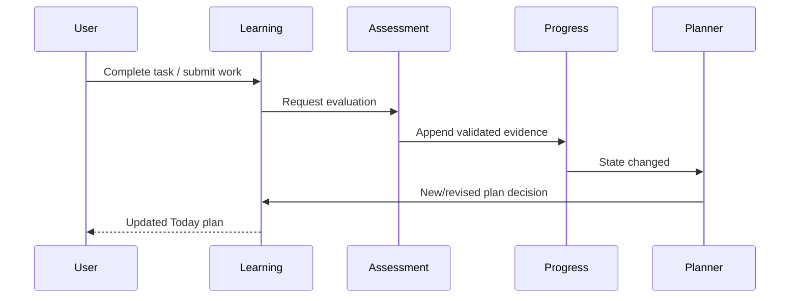

# Adaptive Loop Specification v1

## 1. Purpose

The adaptive loop coordinates modules without transferring ownership of their rules.

## 2. Triggers for replanning

- Diagnostic completed.
- Validated evidence changes knowledge state.
- Task completed, skipped, blocked, or expired.
- User changes today's available minutes.
- Review becomes due.
- Goal or target date changes.
- Curriculum/policy migration explicitly requests replan.

Cosmetic profile changes do not trigger replan.

## 3. Orchestration

1. Command is authorized and validated.
2. Owning module commits state and an outbox event atomically.
3. Consumer processes event idempotently.
4. Progress updates/rebuilds projection if evidence exists.
5. Planner captures `projectionAsOf`, reads a consistent graph/progress/review snapshot, and writes a versioned daily-plan decision.
6. Learning creates/revises unstarted plan items.
7. Roadmap read model exposes the same versions, state labels, blocked paths, current task, and reasons.
8. User sees the new plan and consistent visual route.

For an initial single-process implementation, steps may run synchronously after commit, but contracts and idempotency remain mandatory.

Phase 4 implements this boundary with the MySQL `outbox_events` envelope. A dispatcher
claims stable `(occurred_at, id)` batches using a 30-second lease, retries with bounded
exponential backoff, and stops after ten failed attempts. Handlers allowlist the exact
owner/event/version tuple. `AssessmentEvidenceCreated` is deduplicated by source event,
then the learner/node projection is locked and rebuilt from ledger order
`(observed_at, source_event_id)` before `KnowledgeStateChanged` is emitted. There is no
broker and no planner invocation in Phase 4.

Phase 5 adds a learner-selected study-session execution path, not the adaptive loop.
Its start/complete/skip/blocked/resume/abandon commands commit a task transition and
append-only lifecycle audit in one transaction with an idempotency receipt. It does
**not** create an unhandled outbox event: the Phase 4 dispatcher would otherwise
exhaust retries on an unknown event type. Phase 6 creates plans only through explicit
commands and does not add automatic replanning. Phase 7 must register a versioned
consumer and add the durable event handoff when planner/evaluation orchestration exists.
Self-reported activity never updates Progress or Review.

For the owner-approved Phase 7 task-check path, the event chain is locked as
`AssessmentEvidenceCreated v2` (one per evidence row, with attempt kind/ID and
expected count) → Progress's attempt-level projection barrier → one
`EvidenceAccepted v1` → Review's owned schedule/processed-source receipt → one
`PlanningInputsReady v1` → Planner's unique replan request. Progress emits the
attempt fact only after **all** its evidence rows are projected, even when rounded
mastery/status does not change. Review emits readiness in the same transaction
as its schedule work; Planner never reads ahead of that commit. Diagnostic
attempts may be processed by Review before completion, but only the final
diagnostic attempt is replan-eligible. Legacy v1 evidence/state events keep their
existing handlers and do not retroactively create duplicate P7 replans.

P7.3 persists the Planner request before execution and leases it independently
of outbox delivery. The disabled-by-default worker retries after a rolled-back
executor transaction, reclaims expired leases, and records a terminal failure
after ten attempts. It serializes execution through the Goal application lock.
The production immutable-revision executor is a P7.4 dependency; until then,
neither the worker nor the task-check gate is enabled.

Review is the sole owner of `review_schedules` and stops its legacy direct update
of `user_knowledge.next_review_at`. Progress presents `nextReviewAt` by querying
a bounded Review application contract at the same captured read instant; the
old nullable Progress column is non-authoritative. Neither Review nor Planner
uses another module's persistence adapter/table to cross this boundary.

## 4. Plan revision rules

Phase 6 permits an explicit revision only when every task in the existing planner
plan remains `ASSIGNED`. The new snapshot and revision are immutable records linked
to the superseded revision; only the current/superseded marker changes atomically.
All dynamic inputs and roadmap overlays for a revision use its single server-captured
`projectionAsOf`. Evidence-triggered, partial-plan, missed-day, and time-override
replanning below is Phase 7 work.

- Preserve completed tasks.
- Do not silently delete in-progress tasks.
- Replace only unstarted items unless user explicitly abandons/replans them.
- Maintain `daily_plan.revision` and supersession link.
- Same trigger/event cannot produce duplicate active revision.
- Replan uses server time plus user's stored timezone for learning-day boundaries.
- Every revision's 1–3 items share one input snapshot and `projectionAsOf`; total estimated minutes obey the planner policy budget/tolerance.

## 5. Failure handling

| Failure | Required behavior |
|---|---|
| AI evaluation timeout | Keep attempt; mark pending/retry or needs review |
| Invalid AI output | Reject evidence; audit; never update state |
| State optimistic-lock conflict | Retry bounded times, then queue/rebuild |
| No eligible task | Run documented fallback; never let AI bypass prerequisite |
| No time-fit task | Phase 6 returns `NO_SAFE_RECOMMENDATION`/`NO_TIME_FIT_VARIANT` and asks for more time; a later approved micro-assessment may be offered only with real content/evaluation |
| Replan fails after completion | Completion remains committed; retry replan idempotently |
| Curriculum version retired | Existing history remains; controlled migration required |

## 6. Missed days

Missed tasks do not reduce mastery automatically and are not copied mechanically. At next visit, mark eligible old assignments expired/superseded according to policy, recalculate review urgency, and produce a fresh achievable plan.

## 7. Goal completion

A goal is completion-eligible when all required terminal nodes reach their configured effective mastery and confidence, no critical misconception remains active, and required application/mastery checks pass. The goal module makes the final deterministic transition using a versioned policy.

## 8. Observability

Record correlation ID, trigger, state snapshot/version, graph/policy versions, decision ID, latency, retry count, and outcome. Metrics include evaluation failure rate, replan latency, no-recommendation rate, duplicate suppression, and plan completion rate.

The roadmap projection records graph version, progress snapshot version, review
snapshot version, planner decision/revision, and `projectionAsOf`. A stale combination
must be labelled/refetched; the client must not merge incompatible versions into a
seemingly current map.

## 9. End-to-end acceptance

Given HTTP mastery 0.35 and REST API blocked by HTTP, completing a validated HTTP practice increases relevant dimensions, creates exactly one new state projection, and triggers a new plan. REST API is selected only after the prerequisite threshold is met; otherwise another HTTP/remedial task is selected. Repeating the same completion request does not duplicate evidence, state update, or active plan revision.

## 10. Phase 7 Implementation Notes (2026-09-23)

Phase 7 delivered the adaptive loop infrastructure:
- **Evidence generation**: `TaskCheckController` receives attempts and issues `AssessmentEvidenceCreated` events via the `outbox_events` table.
- **State change**: `AssessmentEvidenceHandler` consumes the event, appends to the ledger, and projects a new knowledge state, yielding a `KnowledgeStateChanged` event.
- **Replan trigger**: `KnowledgeStateChangedHandler` updates the review schedule and issues a durable `ReplanRequest` to the `JdbcReplanRequestStore`.
- **Replan worker**: The `PlannerReplanWorker` polls the request store with a 30s leased lock, executes the `planner-v2` revision algorithm, and completes the request.

This decoupled, attempt-level architecture ensures that assessment failures or rapid sequential submissions are handled predictably without creating race conditions in the planner or corrupting the knowledge state. AI evaluation remains deferred to Phase 8.
