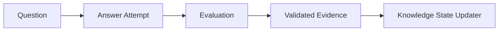

# Assessment Model Specification v1

## 1. Trách nhiệm

Assessment biến câu trả lời của user thành **concept evidence có cấu trúc**. Nó không trực tiếp gán mastery và không tự quyết định user đã hoàn thành prerequisite.

### 1.1 Ranh giới thẩm quyền

```text
Diagnostic evidence is observational, not authoritative mastery.

Evidence answers:
"What did this attempt demonstrate?"

Knowledge State answers:
"What does the system currently estimate the learner knows?"

Planner answers:
"What should the learner do next?"
```

Đây là invariant bắt buộc của domain và giao diện:

- Assessment chỉ ghi nhận điều attempt đã chứng minh theo question mapping, evaluator
  và policy version.
- Chỉ Knowledge State mới tổng hợp chuỗi evidence thành estimate về mastery và
  confidence hiện tại.
- Chỉ Planner mới quyết định hành động học tiếp theo từ graph, state, review và time
  budget.
- API/UI của diagnostic không được gọi score hoặc evidence của một attempt là
  `mastery`, `readiness`, prerequisite đã hoàn thành, hay recommendation.



## 2. Dimension và assessment type

| Dimension | Chứng minh rằng user có thể | Dạng phù hợp |
|---|---|---|
| `RECOGNITION` | Nhận ra khái niệm/đáp án đúng | MCQ, matching |
| `UNDERSTANDING` | Giải thích, phân biệt, suy luận | short answer, scenario |
| `RECALL` | Tự nhớ lại không có gợi ý | free recall, flashcard |
| `APPLICATION` | Áp dụng để giải quyết vấn đề | coding, design, debugging |

`Question.type`: `SINGLE_CHOICE`, `MULTIPLE_CHOICE`, `SHORT_TEXT`, `LONG_TEXT`, `CODE`, `DEBUGGING`, `DESIGN`.

## 3. Data model

### 3.1 Question

| Field | Rule |
|---|---|
| `id`, `version` | Immutable ID; edit nội dung tạo version mới |
| `type` | Enum hợp lệ |
| `prompt` | Bắt buộc |
| `difficulty` | 1–5 |
| `estimated_seconds` | > 0 |
| `scoring_strategy` | `EXACT`, `RUBRIC`, `TEST_CASE`, `AI_ASSISTED` |
| `answer_key` | Không trả về client trước submit |
| `rubric` | Bắt buộc với scoring mở |
| `status` | `DRAFT`, `ACTIVE`, `RETIRED` |
| `source` | `HUMAN`, `AI_GENERATED`, `IMPORTED` |

### 3.2 QuestionKnowledge

Một câu hỏi có thể đo nhiều concept.

| Field | Rule |
|---|---|
| `question_id` | Question version cụ thể |
| `knowledge_node_id` | Node trong graph version tương thích |
| `dimension` | Một trong bốn dimension |
| `weight` | `(0,1]`; tổng weight một question nên bằng 1 |
| `max_evidence_strength` | Trần evidence do kiểu câu hỏi, `[0,1]` |
| `rubric_criterion_key` | Mapping sang tiêu chí chấm |

### 3.3 AssessmentSession

Lưu `user_id`, `goal_id`, `purpose`, `status`, `started_at`, `completed_at`, `graph_version_id`, `assessment_policy_version`.

`purpose`: `DIAGNOSTIC`, `PRACTICE`, `MASTERY_CHECK`, `REVIEW`, `REMEDIAL`.

### 3.4 AnswerAttempt

| Field | Ý nghĩa |
|---|---|
| `id` | Idempotency/audit ID |
| `session_id`, `question_id`, `question_version` | Context cố định |
| `user_id` | Chủ sở hữu |
| `answer_payload` | JSON theo question type |
| `raw_score` | `[0,1]` |
| `self_confidence` | User tự khai `[0,1]`, nullable |
| `time_spent_seconds` | Không âm |
| `submitted_at` | Server time |
| `evaluation_status` | `PENDING`, `EVALUATED`, `REJECTED`, `NEEDS_REVIEW` |

### 3.5 AttemptEvidence

| Field | Ý nghĩa |
|---|---|
| `attempt_id` | Nguồn gốc bắt buộc |
| `knowledge_node_id` | Concept được đo |
| `dimension` | Dimension được cập nhật |
| `score` | `[0,1]` |
| `reliability` | Độ mạnh evidence `[0,1]` |
| `evaluator_type` | `DETERMINISTIC`, `TEST_RUNNER`, `AI`, `HUMAN` |
| `evaluator_version` | Reproducibility |
| `rationale` | Giải thích ngắn, không chứa chain-of-thought |
| `misconception_codes` | Danh sách mã chuẩn hóa |
| `created_at` | Server time |

## 4. Evaluation pipeline

1. Validate session, ownership, question version và payload.
2. Chấm deterministic/test-case trước nếu có thể.
3. Nếu AI-assisted, gửi rubric + expected schema; không gửi answer key không liên quan.
4. Validate AI output bằng schema và range.
5. Áp trần `max_evidence_strength`.
6. Lưu attempt và evidence trong transaction/outbox an toàn.
7. Phát event `AssessmentEvidenceCreated`.
8. Knowledge State consumer xử lý idempotent theo `attempt_evidence.id`.

## 5. Scoring rules v1

### Objective question

`score = earned_points / total_points`.

Phase 3 policy `assessment-objective-v1` makes this concrete:

```text
SINGLE_CHOICE:
  score = 1 when the selected option exactly matches the answer key, otherwise 0

MULTIPLE_CHOICE:
  score = clamp(
      (correctSelections - incorrectSelections) / correctOptionCount,
      0,
      1
  )
```

Calculations use `BigDecimal`, scale 4, `HALF_UP`. Objective questions emit only
`RECOGNITION` or `UNDERSTANDING`. Evidence reliability is capped by the mapping and
multiplied by its concept weight; objective evaluation cannot emit `RECALL` or
`APPLICATION` regardless of client input.

Đoán đúng MCQ không được tạo evidence mạnh bằng application. Reliability mặc định:

| Nguồn | Reliability mặc định |
|---|---:|
| Single-choice recognition | 0.45 |
| Multiple-choice understanding | 0.55 |
| Free recall + rubric | 0.70 |
| Code test cases | 0.90 |
| Human-reviewed application | 0.95 |
| AI-assisted free text | 0.65 |

Các giá trị là policy config có version.

### Multi-concept question

Không sao chép raw score cho mọi concept. Mỗi rubric criterion tạo score riêng; nếu evaluator không tách được, giảm reliability và dùng weighted raw score như fallback.

## 6. AI contract

AI phải trả JSON hợp lệ:

```json
{
  "evaluatorVersion": "assessment-evaluator-v1",
  "overallScore": 0.62,
  "evidence": [
    {
      "knowledgeNodeId": "rest-api",
      "dimension": "UNDERSTANDING",
      "score": 0.7,
      "reliability": 0.65,
      "rationale": "Phân biệt được resource và endpoint nhưng sai về HTTP method.",
      "misconceptionCodes": ["HTTP_METHOD_SEMANTICS"]
    }
  ],
  "needsHumanReview": false
}
```

`evaluatorVersion` phải khớp version được yêu cầu. Provider/model/config version thực
tế do adapter gắn vào audit metadata từ cấu hình trusted; không tin một model tự khai
provider/model identity.

Output bị reject nếu có node/dimension ngoài mapping của question, thiếu hoặc sai
`evaluatorVersion`, hoặc vượt range. AI không được phát event state update trực tiếp.

## 7. Misconception

Misconception dùng taxonomy có version, ví dụ:

- `API_IS_DATABASE`
- `HTTP_METHOD_SEMANTICS`
- `CONTROLLER_OWNS_BUSINESS_LOGIC`

Mỗi code có concept scope, severity, remediation template và trạng thái. Free text của AI chỉ là giải thích; planner sử dụng code chuẩn hóa.

## 8. API tối thiểu

```http
POST /api/v1/assessments/diagnostic
GET  /api/v1/assessments/{sessionId}/next-question
POST /api/v1/assessments/{sessionId}/attempts
GET  /api/v1/assessments/{sessionId}/result
```

Submit cần `Idempotency-Key`. Client không được gửi `user_id` thay cho identity từ access token/session.

Phase 3 implements this API with one completed diagnostic baseline per goal, an
in-progress session lifetime of seven days, immutable pinned question versions, and
eight project-authored Java Backend questions. Leaving the UI preserves the session;
expiry is evaluated from server time.

### Localized presentation

English question text and options are canonical. Vietnamese prompt/option overlays are
read using the same immutable question version and must retain the exact canonical option
ID set. Locale is excluded from answer canonicalization, idempotency hashes, scoring,
evidence, and outbox payloads. Switching language during a diagnostic therefore changes
only presentation and cannot advance or mutate the session.

## 9. Acceptance criteria

- Một attempt retry không tạo evidence trùng.
- MCQ đúng không thể một mình nâng `APPLICATION`.
- Multi-concept answer tạo evidence riêng theo rubric criterion.
- AI trả node lạ hoặc score > 1 bị reject và ghi audit.
- Answer key không xuất hiện trong API question trước submit.
- Mọi evidence truy vết được đến attempt, evaluator và policy version.
- Session hết hạn/khác user không thể submit.
