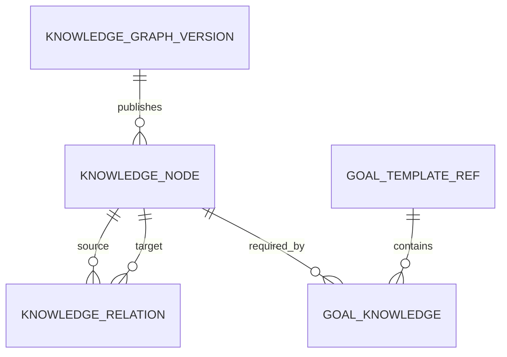

# Knowledge Graph Specification v1

## 1. Trách nhiệm

Knowledge Graph trả lời:

- Mục tiêu học tập gồm những kiến thức nào?
- Kiến thức nào là điều kiện tiên quyết?
- Concept nào liên quan, là thành phần hoặc được áp dụng ở đâu?
- Concept nào đang chặn tiến độ đến goal?

Graph dùng chung cho mọi user. Trạng thái cá nhân không được lưu trong module này.

## 2. Mô hình khái niệm



### 2.1 KnowledgeNode

| Field | Type | Rule |
|---|---|---|
| `id` | BIGINT | Immutable internal MVP ID; API treats it as opaque |
| `slug` | string | Unique trong graph version |
| `name` | string | Bắt buộc |
| `description` | text | Nêu learning outcome, không chỉ định nghĩa |
| `category` | string/enum | Phân nhóm hiển thị |
| `difficulty` | integer | 1–5 |
| `estimated_minutes` | integer | > 0, thời lượng học cơ sở |
| `status` | enum | `DRAFT`, `ACTIVE`, `DEPRECATED`, `ARCHIVED` |
| `version_id` | id | Graph version sở hữu node |
| `metadata` | JSON | Extension, không chứa business rule cốt lõi |

Một node tốt phải đủ nhỏ để đánh giá riêng và đủ lớn để sinh được learning task. Ví dụ `REST API` hợp lệ; `Backend Development` quá rộng; `dấu chấm phẩy ở dòng 12` quá hẹp.

### 2.2 KnowledgeRelation

| Field | Type | Rule |
|---|---|---|
| `id` | id | Immutable |
| `source_node_id` | id | Concept phụ thuộc/được mô tả |
| `target_node_id` | id | Concept đích của relation |
| `type` | enum | Xem bảng dưới |
| `strength` | decimal | `[0,1]` |
| `status` | enum | `ACTIVE`, `DEPRECATED` |
| `rationale` | text | Giải thích cho curator |

Quy ước chiều cạnh:

`A --PREREQUISITE--> B` nghĩa là **A cần biết trước khi học B**.

| Relation | Ý nghĩa | Planner v1 sử dụng? |
|---|---|---|
| `PREREQUISITE` | Điều kiện để mở concept đích | Có |
| `PART_OF` | Source là thành phần của target | Không |
| `RELATED` | Liên quan ngữ nghĩa | Không |
| `APPLIED_IN` | Source được áp dụng trong target | Không |

`strength` của prerequisite biểu thị mức bắt buộc:

- `>= 0.8`: prerequisite cứng.
- `0.5–0.79`: prerequisite hỗ trợ.
- `< 0.5`: không được dùng để khóa trong v1.

Ngưỡng chính xác thuộc Planner Policy.

### 2.3 GoalTemplateRef và GoalKnowledge

| Entity/field | Ý nghĩa |
|---|---|
| `GoalTemplateRef.goal_template_id` | ID trung lập lấy qua public contract của module `goal`; knowledge không sở hữu goal entity |
| `GoalKnowledge.curriculum_key/graph_version_id` | Curriculum và graph version chứa mapping |
| `GoalKnowledge.knowledge_node_id` | Concept thuộc goal |
| `GoalKnowledge.relevance_weight` | Mức quan trọng `[0,1]` |
| `GoalKnowledge.required_mastery` | Mastery cần đạt, mặc định từ policy |
| `GoalKnowledge.is_terminal` | Outcome đầu ra chính |

Goal là tập node có trọng số, không phải một node cha giả.

Java Backend là curriculum đầu tiên. Curriculum cho các ngách IT khác dùng
`curriculum_key`, graph version, goal mapping và content riêng nhưng tuân theo cùng
invariant và traversal contract.

## 3. Invariants

1. `PREREQUISITE` active phải tạo thành DAG; không có self-loop hoặc cycle.
2. Không có hai relation active trùng `(source, target, type)`.
3. Hai đầu cạnh phải thuộc cùng graph version; relation của draft không được trỏ sang node của version đang published hoặc draft khác.
4. Node `ARCHIVED` không được thêm vào goal/task mới.
5. Node đã có evidence không được xóa cứng.
6. Goal active phải có ít nhất một terminal node và mọi terminal node phải truy ngược được về root prerequisite.
7. `slug`, relation direction và ID không đổi trong cùng version đã publish.

## 4. Graph versioning

Trạng thái version: `DRAFT → VALIDATED → PUBLISHED → RETIRED`.

- Chỉ một version được `PUBLISHED` cho cùng curriculum key tại một thời điểm.
- Sửa typo không ảnh hưởng logic có thể tạo patch metadata.
- Thêm/xóa node, đổi prerequisite hoặc goal weight phải tạo graph version mới.
- User state tiếp tục trỏ node ID cũ; migration map ánh xạ `old_node_id → new_node_id` khi cần.
- Planner decision phải lưu `graph_version_id`.

## 5. Dịch vụ domain

### `KnowledgeGraphService`

- `getNode(id, version)`
- `getPrerequisites(nodeId, transitive, version)`
- `getDependents(nodeId, transitive, version)`
- `getGoalSubgraph(goalId, version)`
- `getTopologicalOrder(goalId, version)`
- `countBlockedImportantNodes(nodeId, goalId, stateSnapshot)`

### `GraphValidator`

Kiểm tra duplicate, dangling edge, cycle, invalid range, unreachable terminal và
lifecycle mismatch. Validate fail giữ version ở `DRAFT`. Publish chỉ nhận version
`VALIDATED`; publish fail giữ nó ở `VALIDATED` và không thay đổi version đang
`PUBLISHED`. Việc retire version cũ và publish version mới phải atomic.

## 6. API contract tối thiểu

```http
GET /api/v1/knowledge/nodes/{id}
GET /api/v1/knowledge/nodes/{id}/prerequisites?transitive=true
GET /api/v1/goal-templates/{goalTemplateId}/graph
POST /api/v1/admin/knowledge/versions/{versionId}/validate
POST /api/v1/admin/knowledge/versions/{versionId}/publish
```

Các endpoint ghi yêu cầu quyền curriculum admin. API user chỉ đọc version đã publish.

Sơ đồ theo tiến độ cá nhân dùng roadmap read model tại
`GET /api/v1/goals/{goalId}/roadmap`; endpoint đó kết hợp graph đã publish với snapshot
của progress/review/planner và không thuộc quyền ghi của module knowledge.

## 7. Ví dụ

```json
{
  "goal": "java-backend-developer",
  "nodes": ["http", "rest-api", "spring-boot", "spring-security"],
  "prerequisites": [
    {"source": "http", "target": "rest-api", "strength": 1.0},
    {"source": "rest-api", "target": "spring-boot", "strength": 0.9},
    {"source": "spring-boot", "target": "spring-security", "strength": 1.0}
  ]
}
```

## 8. Acceptance criteria

- Cycle `A → B → C → A` bị từ chối với đường cycle rõ ràng.
- Traversal phân biệt direct và transitive prerequisite.
- Planner chỉ bị khóa bởi `PREREQUISITE`, không bởi `RELATED`.
- Deprecated node vẫn đọc được cho lịch sử nhưng không xuất hiện trong recommendation mới.
- Publish thất bại không làm graph active bị thay đổi.
- Cùng graph version cho cùng topological order ổn định.
- Roadmap cá nhân chỉ hiển thị graph version đã publish và không ghi ngược trạng thái vào knowledge graph.
- Graph lớn có thể query theo bounded neighborhood/progressive expansion mà vẫn giữ stable node/edge IDs và version.

## 9. Implemented Phase 2 contract

- Flyway V6 owns graph/version/node/relation/goal-mapping and lifecycle-audit schema;
  V7 publishes the project-authored `JAVA_BACKEND` graph version `1.0.0`.
- The initial graph contains 17 nodes and 23 relations mapped to
  `JAVA_BACKEND_INTERN`. Terminal outcomes are authentication/authorization,
  integration testing, and Docker/deployment basics.
- Stable topological ordering uses node slug then opaque node ID as the tie-breaker.
- Traversal and validation are iterative/bounded and implemented without a third-party
  graph library. Only active `PREREQUISITE` relations participate in topology/gating.
- Goal-graph reads support optional anchor, depth `0–10`, limit `1–200`, and an opaque
  graph-version-bound cursor. Draft/validated/retired versions are not exposed through
  public reads.
- `innerFringe`, `outerFringe`, and `blocked` are tested pure derivations whose mastery
  threshold and task availability are supplied by callers; they are not persisted.
- Runtime validate/publish commands require `CURATOR` or `ADMIN`. Publication locks the
  curriculum versions and atomically retires the old version, publishes the successor,
  and records lifecycle audit events.

## 10. Localized presentation contract

English node name/description fields remain the canonical graph content. A Vietnamese
translation is keyed by the same graph version and node ID and may change only display
text. Published reads can overlay that text for `vi-VN`; slugs, node IDs, graph versions,
relations, traversal order, cursors, prerequisite semantics, and planner authority are
locale-independent. Missing or invalid translation data falls back to canonical English.
