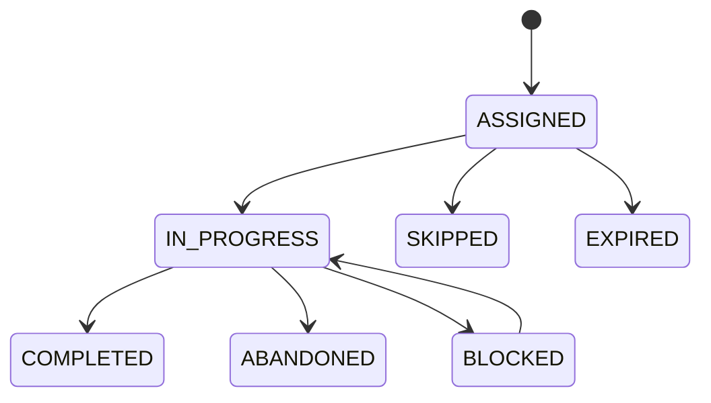

# Learning Task Model Specification v1

## 1. Purpose

A knowledge node describes **what can be known**. A learning task describes **what a learner should do now**. The planner selects task variants; it must not convert a node directly into vague instructions.

## 2. Model

### TaskTemplate

| Field | Rule |
|---|---|
| `id`, `version` | Immutable identity/version |
| `title`, `instructions` | Action-oriented and learner-visible |
| `activity_type` | `DIAGNOSTIC`, `LEARN`, `PRACTICE`, `RECALL`, `APPLICATION`, `REMEDIAL`, `QUICK_VERIFY`, `PROJECT` |
| `difficulty` | 1–5 |
| `estimated_minutes` | Positive, measured over time |
| `min_minutes`, `max_minutes` | Optional variant fit range |
| `evaluation_mode` | `NONE`, `SELF_REPORT`, `OBJECTIVE`, `RUBRIC`, `TEST_CASE` |
| `status` | `DRAFT`, `ACTIVE`, `RETIRED` |
| `graph_version_id` | Compatible curriculum version |
| `content_source` | `CURATED`, `AI_ASSISTED`, `IMPORTED` |
| `sequence_group_key`, `sequence_position` | Optional declared pedagogical sequence; planner không tự suy diễn thứ tự từ title |

### TaskTemplateKnowledge

Maps a task to one or more nodes with `role` (`PRIMARY`, `SUPPORTING`, `PREREQUISITE_REVIEW`), dimension targeted, and weight. At least one `PRIMARY` node is required.

### LearningTask

An assigned instance containing `user_id`, `user_goal_id`, `template_id/version`, `planner_decision_id`, `status`, planned duration, task payload snapshot, assigned/start/completion timestamps, and optimistic version.

Status transitions:



Terminal status cannot be changed except through an explicit correction command with audit record.

## 3. Task composition

The Today plan may sequence small tasks:

1. Learn selected resource section.
2. Practice or apply.
3. Recall/explain or mastery check.

Planner may select a complete prefix/subsequence only where templates explicitly
declare a valid sequence and every selected item remains pedagogically complete. A
Today plan contains 1–3 ordered, distinct template versions and must fit the policy
time budget.

A task can reference resources and questions, but resources/questions remain owned by their modules. Snapshot learner-visible content/version so later edits do not rewrite history.

## 4. Completion and evidence

- Marking a reading task complete does not create mastery evidence by itself.
- Objective/rubric/test-case evaluation can create evidence through Assessment.
- Self-report may create engagement metadata and very low-reliability evidence only if policy explicitly allows it.
- Completion command is idempotent.
- Actual minutes inform planning estimates but do not directly increase mastery.

## 5. Time variants and chunking

Templates can share a `variant_group_key`, for example 10/25/45-minute REST practice. Planner selects a variant that fits the budget. Automatic text truncation is forbidden; each variant must remain pedagogically complete.

A long project task may be chunked only at declared checkpoints. Each checkpoint has its own objective, duration, completion rule, and optional evaluation.

## 6. Repetition rules

- Do not assign the same template version after two recent unsuccessful attempts when an alternative/remedial variant exists.
- Review tasks may repeat according to review schedule.
- Planner stores recent template/variant history and reason for deliberate repetition.

## 7. Resources

`Resource` includes title, type, canonical URL/content reference, provider, difficulty, estimated minutes, license/source metadata, and status.

`KnowledgeResource` selects the exact section/anchor, purpose, estimated minutes, and compatible node/version. Do not tell the learner to read an entire large documentation site when a bounded section is intended.

## 8. Commands

```text
assignTask(decisionId, templateVersion)
startTask(userId, taskId)
completeTask(userId, taskId, completionPayload, idempotencyKey)
skipTask(userId, taskId, reason)
reportBlocked(userId, taskId, reason)
```

## 9. Acceptance criteria

- Assigned task preserves template/content version.
- User cannot access or complete another user's task.
- Duplicate completion produces one outcome/evaluation request.
- Reading completion alone does not raise application mastery.
- A 30-minute plan selects a pedagogically valid short variant.
- Retired templates remain readable historically but are not newly assigned.
- Two repeated failures lead to an alternative/remedial selection when available.
