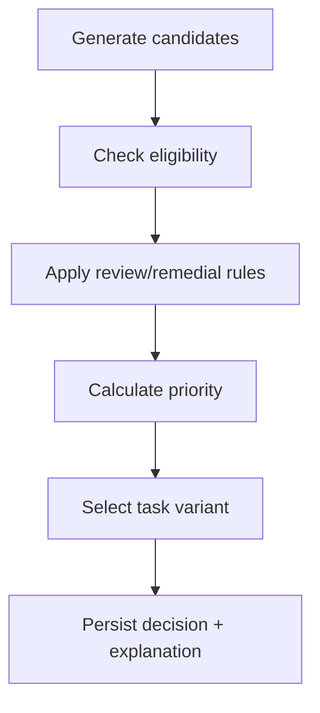

# Planner Algorithm Specification v1

## 1. Trách nhiệm

Planner chọn learning task tiếp theo dựa trên goal, graph, user state, lịch review và giới hạn thời gian. Planner v1 là deterministic rule engine; AI không trực tiếp xếp hạng.



## 2. Input và output

### PlanningContext

```json
{
  "userId": "u-1",
  "goalId": "java-backend",
  "availableMinutes": 20,
  "preferredTaskTypes": ["PRACTICE", "RECALL"],
  "now": "2026-09-22T08:00:00Z",
  "graphVersionId": "kg-v1",
  "plannerPolicyVersion": "planner-v1"
}
```

### DailyPlanDecision và PlannerDecision

Một planner run trả `DailyPlanDecision` chứa 1–3 `PlannerDecision` có thứ tự, tổng
estimated minutes, remaining minutes, input snapshot, graph version và policy version.
Mỗi item decision trả về `task_id`, `knowledge_node_ids`, `activity_type`,
`estimated_minutes`, `priority_score`, `reason_codes`, `blocked_by`, `alternatives`,
`input_snapshot_id`, `graph_version_id`, `policy_version`.

Reason codes tối thiểu:

- `GOAL_RELEVANT_GAP`
- `UNLOCKS_DEPENDENCIES`
- `REVIEW_DUE`
- `MISCONCEPTION_REMEDIATION`
- `LOW_CONFIDENCE_VERIFY`
- `TIME_FIT`
- `PREREQUISITE_BLOCKED`

## 3. Bước 1 — Candidate generation

Candidate gồm:

1. Node thuộc goal subgraph chưa đạt required mastery.
2. Node đã mastered nhưng review due.
3. Node có misconception active.
4. Prerequisite đang chặn terminal/important node.

Loại bỏ node archived, ngoài graph version và node không có learning task active.
Deduplicate theo `(knowledgeNodeId, candidateReason)`. Trước khi áp candidate limit,
sắp xếp ổn định theo: review/remedial urgent trước, goal relevance giảm dần,
terminal unlock value giảm dần, topological order, rồi stable node ID tăng dần.
Candidate limit thuộc policy, mặc định 100, để tránh traversal không giới hạn. Snapshot
lưu tổng candidate trước/sau limit và ordering key để audit.

## 4. Bước 2 — Eligibility

Một node eligible khi mọi prerequisite cứng thỏa:

```text
effectiveMastery(prerequisite) >= PREREQUISITE_THRESHOLD
OR prerequisite is waived by an explicit, audited rule
```

Mặc định `PREREQUISITE_THRESHOLD = 0.75`, hard prerequisite strength `>= 0.8`.

- Node review/remedial của chính prerequisite luôn eligible.
- Node đích bị khóa không được chọn chỉ vì priority cao.
- Planner ghi danh sách `blocked_by` để UI giải thích.
- Không dùng `RELATED`, `PART_OF`, `APPLIED_IN` để khóa.

## 5. Bước 3 — Signals

Mọi signal được normalize và clamp `[0,1]`. Công thức có mẫu số bằng 0 phải dùng
fallback được định nghĩa, không tạo `NaN`/infinity.

### Knowledge gap

```text
gap = clamp((requiredMastery - effectiveMastery) / requiredMastery, 0, 1)
```

### Goal relevance

Lấy `GoalKnowledge.relevance_weight`; prerequisite ngoài membership nhận relevance suy giảm từ dependent gần nhất.

### Prerequisite value

```text
prerequisiteValue = weightedBlockedImportantNodes / maxBlockedValueInCandidateSet
```

Chỉ tính dependent thuộc goal và chưa đạt.
Nếu `maxBlockedValueInCandidateSet = 0`, `prerequisiteValue = 0`.

### Learning ROI

```text
learningROI = expectedMasteryGain × unlockValue / normalizedEffort
```

`normalizedEffort` phải lớn hơn 0. Kết quả được clamp `[0,1]`. Nếu chưa đủ dữ liệu,
dùng prior theo task type và difficulty; phải lưu version.

### Time fit

```text
timeFit = 1                       if estimated <= available
timeFit = available / estimated   otherwise
```

Task vượt thời gian không bị loại nếu có declared checkpoint/chunk phù hợp; không tự
cắt nội dung. Task variant/checkpoint phải không vượt quá
`availableMinutes + TIME_TOLERANCE_MINUTES`. Tolerance thuộc policy và mặc định v1 là
`0`, vì vậy plan không vượt budget đã khai báo.

### Review urgency

```text
reviewUrgency = clamp(daysOverdue / REVIEW_MAX_DAYS, 0, 1)
```

### Misconception urgency

Từ severity × confidence của misconception active.

## 6. Priority formula v1

Không nhân toàn bộ signals vì một giá trị 0 có thể triệt tiêu sai. Dùng weighted sum với eligibility gate:

```text
priority = eligible × 100 × (
    0.28 × gap
  + 0.22 × goalRelevance
  + 0.18 × prerequisiteValue
  + 0.12 × learningROI
  + 0.08 × timeFit
  + 0.08 × reviewUrgency
  + 0.04 × misconceptionUrgency
)
```

Override có kiểm soát:

1. Misconception severity cao: thêm tối đa 15 điểm.
2. Review quá hạn > 14 ngày: thêm tối đa 10 điểm.
3. Concept vừa thất bại 2 lần liên tiếp: không chọn lại cùng task variant; chọn remedial hoặc prerequisite review.

Điểm cuối clamp `[0,100]`. Mọi bonus phải hiện trong explanation.

## 7. Tie-breaker

Nếu chênh lệch priority < `0.01`, chọn theo thứ tự:

1. Review/remedial urgent hơn.
2. Node unlock nhiều goal weight hơn.
3. Task fit thời gian hơn.
4. Difficulty thấp hơn.
5. Stable ID tăng dần.

Quy tắc cuối bảo đảm deterministic.

## 8. Task selection

Knowledge node không phải task. Sau khi chọn node, chọn activity theo state:

| State pattern | Activity |
|---|---|
| Chưa có evidence | `DIAGNOSTIC` hoặc `LEARN` |
| Recognition cao, application thấp | `PRACTICE`/`APPLICATION` |
| Mastery cao, confidence hệ thống thấp | `QUICK_VERIFY` |
| Review due | `RECALL` |
| Misconception active | `REMEDIAL` |
| Vừa học, chưa hiểu | `REMEDIAL` với explain-and-check payload |

Task variant phải active, đúng graph version, phù hợp duration và không lặp variant gần nhất nếu có lựa chọn tương đương.

### Today-plan composition

Planner chọn tối đa 3 item. Sau mỗi lựa chọn, trừ estimated minutes khỏi remaining
budget, loại template/version đã chọn và tính lại time-fit/variant cho phần còn lại;
knowledge state không được giả định thay đổi trước khi learner thực hiện task.

- Không item nào hoặc tổng plan vượt budget cộng tolerance của policy.
- Không lặp cùng task/template version trong một plan.
- Chuỗi `LEARN → PRACTICE/APPLICATION → RECALL/CHECK` chỉ được ưu tiên khi template
  khai báo quan hệ sequence và toàn bộ phần được chọn vẫn hoàn chỉnh về sư phạm.
- Nếu chỉ một task an toàn phù hợp thì plan một item là hợp lệ.
- Nếu không còn task phù hợp, dừng thay vì lấp đầy bằng task giá trị thấp hoặc để AI
  tự tạo task.
- Mọi item dùng cùng planning snapshot; mỗi item giữ decision/explanation riêng và
  plan giữ thứ tự đã chọn.

## 9. Pseudocode

```text
plan(context):
  validate(context)
  graph = loadGoalSubgraph(context.goalId, context.graphVersionId)
  state = loadUserStateSnapshot(context.userId, graph.nodes, context.now)
  candidates = stablePreLimit(generateCandidates(graph, state), policy.candidateLimit)

  scored = []
  for candidate in candidates:
    eligibility = resolvePrerequisites(candidate, graph, state)
    if not eligibility.allowed:
      recordBlocked(candidate, eligibility.blockedBy)
      continue

    signals = calculateSignals(candidate, graph, state, context)
    score = calculatePriority(signals, context.policyVersion)
    task = selectTaskVariant(candidate, state, context)
    if task exists:
      scored.add(candidate, task, score, signals)

  planItems = []
  remainingMinutes = context.availableMinutes
  while planItems.size < 3:
    ranked = rerankForRemainingTime(scored, remainingMinutes, planItems)
    next = ranked.firstCompatible()
    if next does not exist and planItems is empty:
      next = firstDocumentedFallback()
    if next does not exist:
      break
    planItems.add(next)
    remainingMinutes -= next.estimatedMinutes
    excludeSelectedTemplate(scored, next.templateVersion)

  result = buildDailyPlanDecision(planItems, remainingMinutes)
  persistPlanAndItemDecisions(result, snapshot, versions, explanations)
  return result
```

## 10. Fallback

Nếu không có recommendation cho item đầu tiên:

1. Nếu mọi node mastered: chọn review due hoặc trả `GOAL_COMPLETED`.
2. Nếu tất cả bị khóa: chọn prerequisite chưa đạt gần nhất.
3. Nếu thiếu task phù hợp thời gian: trả micro-assessment ngắn.
4. Nếu graph/task config lỗi: trả `NO_SAFE_RECOMMENDATION`, ghi operational alert; không để AI tự bịa task không kiểm soát.

## 11. Audit và explainability

Mỗi item decision lưu snapshot hash và top 3 candidate với signal breakdown. Daily
plan lưu ordered item decisions và remaining budget. UI giải thích ngắn, ví dụ:

> Học REST API tiếp theo vì đây là khoảng trống lớn, phù hợp 20 phút và mở khóa Spring Boot.

Không hiển thị công thức kỹ thuật cho learner mặc định, nhưng admin/debug API có thể xem đầy đủ.

## 12. Acceptance criteria

- Node có prerequisite cứng chưa đạt không bao giờ được chọn.
- Review due có thể thắng node mới khi urgency đủ cao và lý do được lưu.
- Available time 20 phút không chọn task 45 phút nếu không có variant/chunk phù hợp.
- Today plan có 1–3 task, không lặp template version và tổng estimated minutes không vượt budget khi tolerance v1 bằng 0.
- Cùng context, state snapshot, graph và policy cho cùng decision.
- Candidate set lớn hơn limit vẫn bị cắt theo stable pre-limit order và cho cùng kết quả khi replay.
- Candidate set không có blocked value cho `prerequisiteValue = 0`, không tạo `NaN`/infinity.
- Hai lần fail cùng variant kích hoạt remedial/alternative, không lặp vô hạn.
- Planner trả explanation và top alternatives.
- AI outage không làm planner mất khả năng xếp hạng task đã có.
