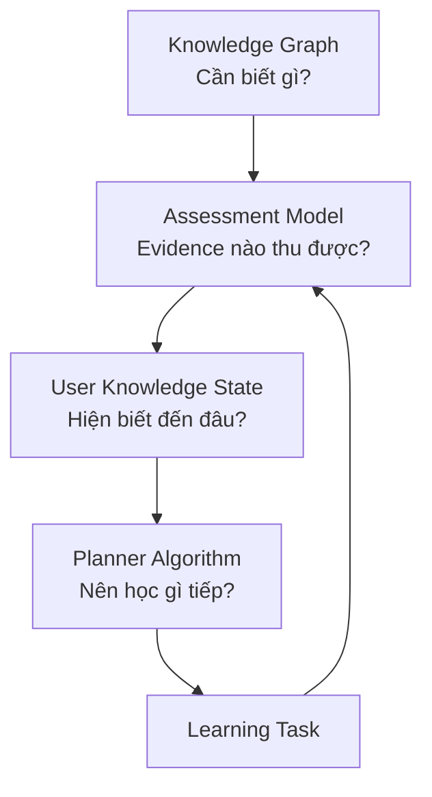

# Adaptive Learning Domain Engine

## 1. Mục đích

Thư mục này là **nguồn sự thật (source of truth)** cho domain engine của hệ thống học tập thích ứng. Coding agent phải đọc toàn bộ tài liệu trong thư mục này trước khi thiết kế database, API, service hoặc test liên quan.

Đây là **project documentation**, không phải CLI và không phải MCP:

- **Docs** mô tả hệ thống phải hoạt động như thế nào.
- **CLI** là giao diện dòng lệnh dùng để chạy agent hoặc ứng dụng.
- **MCP** cung cấp công cụ/dữ liệu bên ngoài cho agent.

Docs không tự động được agent đọc. Repository nên có `AGENTS.md` trỏ đến thư mục này và yêu cầu agent đọc đúng tài liệu theo phạm vi thay đổi.

## 2. Phạm vi MVP v1

Domain engine gồm bốn phần liên kết:

Các tài liệu bắt buộc:

1. [KNOWLEDGE_GRAPH.md](KNOWLEDGE_GRAPH.md)
2. [ASSESSMENT_MODEL.md](ASSESSMENT_MODEL.md)
3. [USER_KNOWLEDGE_STATE.md](USER_KNOWLEDGE_STATE.md)
4. [PLANNER_ALGORITHM_V1.md](PLANNER_ALGORITHM_V1.md)
5. [LEARNING_TASK_MODEL.md](LEARNING_TASK_MODEL.md)
6. [ADAPTIVE_LOOP.md](ADAPTIVE_LOOP.md)

## 3. Nguyên tắc kiến trúc

- Domain engine quyết định bằng quy tắc xác định, có version và có thể kiểm thử.
- AI chỉ tạo nội dung, đánh giá câu trả lời mở và đề xuất evidence; AI không tự đặt mastery cuối cùng hoặc bỏ qua prerequisite.
- Mọi cập nhật knowledge state phải truy vết được về evidence gốc.
- Knowledge node khác learning task; một concept có thể sinh nhiều task theo thời lượng và loại hoạt động.
- Điểm số nội bộ dùng miền `[0, 1]`.
- Không xóa cứng dữ liệu đã được tham chiếu; dùng trạng thái lifecycle.
- Các hệ số/ngưỡng phải nằm trong cấu hình có version, không rải hard-code trong service.
- Cùng input, graph version và policy version phải cho cùng kết quả planner.
- Domain engine không chứa nhánh logic riêng cho Java Backend. Mỗi ngách IT là curriculum/graph/content có version dùng chung các contract domain.
- Sơ đồ trực quan cho learner là read model của graph + state + planner; không phải nguồn sự thật thứ hai.

## 4. Ranh giới module

| Module | Sở hữu | Không sở hữu |
|---|---|---|
| `knowledge` | Concept, goal, relation, graph validation | Điểm của user |
| `assessment` | Question, attempt, evaluation, evidence | Mastery cuối cùng |
| `progress` | Evidence ledger, dimension score, mastery, review state | Chọn task tiếp theo |
| `planner` | Candidate, eligibility, ranking, recommendation | Sinh đáp án AI |
| `learning` | Task, resource, completion | Graph và mastery policy |
| `ai` | Generate/evaluate/explain có schema | Quyết định domain cuối cùng |

## 5. Shared vocabulary

| Thuật ngữ | Ý nghĩa |
|---|---|
| Knowledge node | Một đơn vị kiến thức có thể đánh giá được |
| Goal | Mục tiêu gồm tập knowledge node và trọng số |
| Evidence | Kết quả đánh giá một dimension của một concept |
| Dimension | `RECOGNITION`, `UNDERSTANDING`, `RECALL`, `APPLICATION` |
| Mastery | Tổng hợp có trọng số từ các dimension |
| Confidence | Độ tin cậy của hệ thống vào estimate, không phải mức tự tin của user |
| Self-confidence | Mức user tự khai khi trả lời |
| Eligible | Concept có đủ prerequisite để planner chọn |
| Review due | Concept cần ôn theo lịch duy trì |
| Planner decision | Bản ghi giải thích vì sao một task được chọn |

## 6. Thứ tự triển khai

1. Knowledge Graph và validator.
2. Assessment và evidence contract.
3. Knowledge State updater và replay.
4. Learning Task lifecycle.
5. Planner v1 và decision log.
6. Adaptive loop end-to-end.
7. AI adapters sau khi domain contract ổn định.

## 7. Definition of Done cho domain change

Một thay đổi domain chỉ hoàn tất khi:

- Tài liệu tương ứng được cập nhật.
- Schema migration và backward compatibility được xem xét.
- Unit test cho công thức/rule và integration test cho flow được thêm.
- Decision/evidence vẫn audit được.
- Version policy/config được tăng nếu hành vi tính toán thay đổi.
- Không để AI output đi thẳng vào state mà chưa validate.

## 8. Chỉ dẫn cho coding agent

Trước khi code, agent phải:

1. Đọc `README.md` và tài liệu domain liên quan.
2. Nêu assumptions còn thiếu; không tự thay đổi business rule đã chốt.
3. Lập mapping: requirement → entity/service/API/test.
4. Giữ công thức trong pure function để unit test được.
5. Trả về lý do quyết định cho mọi recommendation.

Nếu code hiện tại mâu thuẫn với tài liệu, agent phải báo xung đột và không âm thầm chọn một phía.
